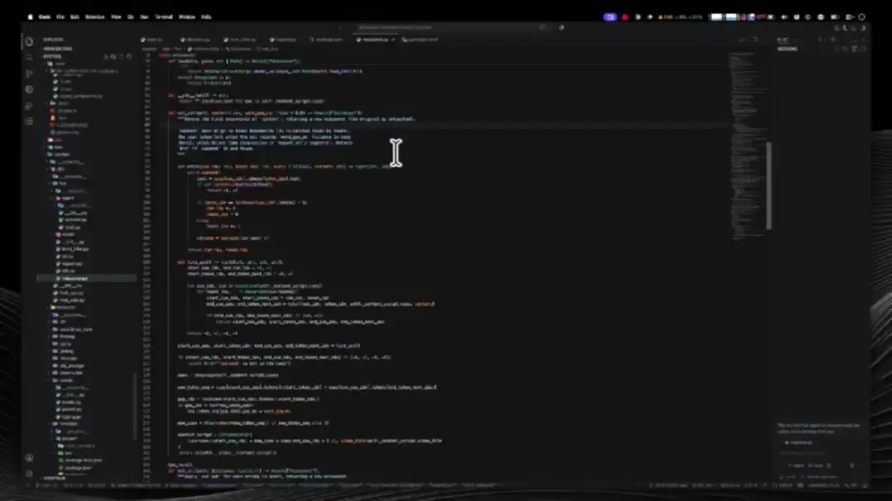

<p align="center">
  
</p>

<h1 align="center">SightRead</h1>

<p align="center">
  Vibe coding 时代的代码强化阅读器，从微观代码块到宏观代码库。<br>
  视觉强化让你读得更快更好，AI 导读为你指出哪里值得读，宏观寻路帮你标出入口到功能的代码路径。
</p>

<p align="center">
  <a href="https://marketplace.visualstudio.com/items?itemName=WaylongLeon.sightread"></a>
  <a href="https://marketplace.visualstudio.com/items?itemName=WaylongLeon.sightread"></a>
  <a href="https://marketplace.visualstudio.com/items?itemName=WaylongLeon.sightread&amp;ssr=false#review-details"></a>
  <a href="https://open-vsx.org/extension/WaylongLeon/sightread"></a>
  <a href="https://open-vsx.org/extension/WaylongLeon/sightread"></a>
  <a href="https://github.com/pyeprog/sightRead/blob/main/LICENSE"></a>
</p>

<p align="center"><a href="https://github.com/pyeprog/sightRead/blob/main/README.md">English</a> | <b>简体中文</b></p>

<p align="center">
  
</p>

<p align="center">
  
</p>


## 💭 为什么

<p align="center">
  
</p>

> 不读代码的人无法掌控产品的走向，无法控制项目的质量，无法学到任何东西。

你让Agent来写代码，但如果不读这些代码，那他写什么就跟你毫无关系。
Idea is cheap, code is even cheaper these days. AI is your tool, not your master. And what still matters these days is your experience of your own adventure.

诚然，读或不读代码，很多时候并不是一个问题，只不过是一种价值选择。
而这个插件，给那些仍旧想要阅读代码的人提供一些视觉上的辅助，希望它能帮你读得更快，读得更顺。

现在人类不是代码生产的大头，机器才是。阅读代码理解并做决策是当下的瓶颈。当海量代码放在你眼前，LLM能帮你梳理大结构和框架，但不能帮你细读（读细节代码和读LLM给的summary，成本相同）。
SightRead强化“人的阅读能力“本身，在你的代码上附上一层视觉辅助（可随时开关），让你像音乐家一样，看到code，逻辑图景就能自然浮现。
而在v1.4.0之后，我做了一个违背祖宗的决定，增加了AI辅助阅读。但它不是那种把代码嚼碎了喂给你的恶心玩意儿，它只是克制的告诉你哪里该读一读，哪里可以放掉。整个核心仍旧是：“你 理解 代码”。

<p align="center">
  
</p>

## ✨ 功能

一组正交的功能，各自提供不同的视觉辅助（见 design.md §2）：

- 🦴 **骨架折叠** —— 快速折叠与展开函数内已有的代码块。读函数时，可以先折叠看函数的大结构，对感兴趣的代码块再展开仔细阅读。
- 🖍️ **荧光笔（标记）** —— 对于一些难读的、 tricky的代码块，可以先用荧光笔打个标记（`⌘K 1`–`5` 直接落五色之一），也可以在这个标记上写下一个简短的note，标注它是干啥的。手动标记与 AI 解读步骤是同一个模型：同一套渲染、同一个 `Filter Marks…`（任何颜色或角色一键全局隐藏）、同一条编辑规则——编辑只删被碰到的标记，其余各自平移。色板有两条带可选（`sightread.palette`：vivid / soft），深浅主题各有独立取值。
- 🎯 **变量描边** —— 在函数的上下文里面，把当下光标指向的symbol标出来，方便看当下这个变量是在哪里创建的，又在哪里使用的。
- 🔦 **聚光灯** —— 排除其他函数、其他无关代码块的视觉干扰。点击状态栏的 👁 按钮，从列表里选一个档位。
  1. **Function** —— 只看当前函数，其他函数一律dim
  2. **Segment** —— 只看当前代码块，其他代码块一律dim
  3. **Segment+Var** —— 只看当前代码块和相关代码块，其他代码块一律dim，这个模式我用的最多。
  4. **Off** —— 关闭聚光灯，默认模式。
- 🧩 **自动分代码块** —— 按空行 + 关键词把函数切成**递归结构**，方便在segment窗口展示函数大结构，点击可以跳转到相应代码块。节点旁还会以灰色小字显示压缩后的条件/表达式（悬停可看完整首行）。Segments 面板会跟随光标：光标所在的段自动选中；聚光灯开启时，无关的段在面板里也会像编辑器里一样压暗。
- 🚪 **入口点** —— 从"外部世界从哪里调进来"开始读文件，而不是从第一行开始读。每个入口声明的上方有一条 CodeLens：`» entry — 3 external refs`，点击即可 peek 这些引用。每个顶层符号按引用位置分类：被其他文件引用 → 入口；只在文件内被引用 → 无 lens；找不到任何引用 → 弱化显示的 `suspected entry`（`activate` 这类框架钩子、路由 handler——或者死代码）。`Go to Entry Point…` 随时列出文件的全部入口；**Entry Points** 视图（默认折叠）在 code review 时把它们常驻在侧边栏——还有一个 **Module** 组，列出进入整个目录的入口：所有被目录外引用的符号，以及 barrel 再导出的名字。
- 🧭 **Trail（阅读轨迹）** —— 侧边栏视图，在它打开期间把你的跳转变成调用结构图：跳到定义，被调函数出现在出发函数之下；跳到引用，调用方成为父节点。不做全项目扫描——只记录你真实走过的结构性跳转（每一条都经 definition provider 验证），结构随阅读自然显现。子节点按调用位置排序，并显示它在调用方里被调用的行（`↙ L88`，右键 `Go to Call Site` 一步跳达）；函数体内有荧光笔标记的节点以标记色染色，视图还会跟随光标——你正身处的节点自动选中。轨迹只存在于内存中，关窗即弃。
- 🤖 **AI 辅助阅读** —— 插件的可选 AI 层，一以贯之的哲学：只给路标，不翻译代码。三条命令都驱动你已有的 coding-agent CLI（`claude`(claude code)、`codex`(codex cli)、`opencode`、`pi`、`cursor-agent`、`devin`、`aider`、`agy`——自动探测，可配置自定义命令），headless 运行，需要你自己事先登录或配置 API key。
  - `SightRead: Interpret Current (AI)` —— 光标处的代码——函数、类、整个文件——被**就地**标注为按角色着色的步骤：主体在哪里，哪些是准备/兜底/特例处理，每个核心实体*为什么*存在。步骤就是普通标记：可以改备注、逐条删除、按角色过滤；解读整体挂在 Markers 视图下。
  - `SightRead: Find Logic Routes (AI)` —— 输入一个阅读目标（"X 是怎么实现的？"），agent 只读探索仓库，把一条**规划路线**种进 Trail 视图：从入口起步的暗色树，★ 标出真正实现该目标的那几跳，悬停可看 AI 的"为什么路过这里"。光标所在符号会随 prompt 一起发出，目标里直接写"它"也有确定指代（"谁调用了它？"）。规划的跳会随着你真正读到而点亮；真实跳转会把规划的边转正。多条路线并存——你正在读的路线的目标显示在树顶。
  - `SightRead: Trace Back to Entries (AI)` —— 反过来：列出所有能到达光标处代码的入口，铺成汇聚于它的链（★ 标在入口上）。路线命令需要 harness 支持只读探索——`claude` / `codex` / `opencode` / `devin` / `agy` 内置，自定义 profile 可声明 `exploreArgs`；原始回复与被丢弃的跳都记录在 "SightRead" 输出频道。
- 🗂️ **侧边栏** —— SightRead 活动栏容器包含四个视图：**Segments**（当前函数的段落树）、**Markers**（工作区内所有标记与 AI 解读）、**Trail**（你走过的调用结构，以及 AI 规划的路线）和 **Entry Points**（当前文件与所在模块的入口——review 时才展开）。它们合在一起天然覆盖了 Outline 的功能——比起 Outline 不加筛选地列举所有 symbol，SightRead 能更好地向你展示当前阅读代码的真正结构。


## ⌨️ 命令

所有命令在命令面板中都以 `SightRead:` 为前缀；常用命令也在编辑器右键菜单（**SightRead** 子菜单）和侧边栏视图标题栏里。

| 命令 | 作用 |
|---|---|
| `SightRead: Fold Skeleton` / `Unfold Skeleton` | 折叠当前函数内的所有代码块先看大结构，再展开它们 |
| `SightRead: Mark Selection with Color…` | 给选区打荧光标记，选颜色 |
| `SightRead: Mark Selection with Note…` | 选颜色并附上可选的备注 |
| `SightRead: Mark Selection: Yellow` … `: Purple` | 直接落该色（每色一条命令） |
| `SightRead: Edit Marker Note` | 给光标处的标记添加/编辑简短备注 |
| `SightRead: Remove Markers in Selection` | 清除选区内的标记 |
| `SightRead: Remove Markers in Current Function` | 清除当前函数内的标记 |
| `SightRead: Remove Markers in File` | 清除当前文件内的标记 |
| `SightRead: Clear All Markers and Guides` | 清除工作区内的全部标记与 AI 解读 |
| `SightRead: Filter Marks…` | 多选保留可见的颜色与 AI 角色，未勾选的全局消失——编辑器、视图、label 染色一并 |
| `SightRead: Interpret Current (AI)` | AI 就地标注光标处的函数/类/文件，产出带角色的路标 |
| `SightRead: Find Logic Routes (AI)` | 输入阅读目标，agent 探索仓库并把规划路线（暗色）种进 Trail 视图 |
| `SightRead: Trace Back to Entries (AI)` | 列出所有能到达光标处代码的入口，铺成 Trail 视图里的链 |
| `SightRead: Spotlight: Choose Level…` | 从列表选档位，等同点击状态栏的 👁 |
| `SightRead: Spotlight: Off` / `: Function` / `: Segment` / `: Segment + Variables` | 直接切到某档 |
| `SightRead: Toggle Variable Tint` | 开关变量描边 |
| `SightRead: Go to Segment…` | QuickPick 跳转到当前函数的某个段 |
| `SightRead: Go to Entry Point…` | QuickPick 跳转到文件的某个入口点 |
| `SightRead: Clear Trail` | 清空调用结构，规划路线一并清除 |

视图条目各有右键操作：标记——`Edit Note` 与行内删除；段——`Mark…` / `Mark with Note…` / `Fold Inside` / `Unfold Inside` / `Remove Markers`；trail 节点——`Go to Call Site` 与行内移除。

## ⌨️ 默认快捷键

统一的 `⌘K` chord 家族（Windows/Linux 为 `Ctrl+K`）：

| 按键 | 动作 |
|---|---|
| `⌘K 1` … `⌘K 5` | 给选区落 黄/红/绿/蓝/紫 标记 |
| `⌘K C` | 给选区打标记，选颜色 |
| `⌘K N` | 给选区打标记，颜色 + 备注 |
| `⌘K ⌫` | 删除光标/选区碰到的标记 |
| `⌘K G` | AI 解读当前代码 |
| `⌘K L` | 选聚光灯档位 |
| `⌘K [` / `⌘K ]` | 折叠 / 展开骨架 |

Cursor 用户注意：Cursor 把裸 `⌘K` 绑给了 inline edit，编辑器有焦点时会遮蔽所有 `⌘K` chord——想用这些键位需先改绑 Cursor 的 `⌘K`。

## ⚙️ 设置

| 设置项 | 默认值 | 说明 |
|---|---|---|
| `sightread.palette` | `vivid` | 所有标记 accent 的色带（`vivid` / `soft`——同色相、彩度更收敛），深浅主题各有取值 |
| `sightread.marker.notePosition` | `lineEnd` | 标记备注显示在行首还是行尾 |
| `sightread.spotlight.defaultMode` | `off` | 启动时的聚光灯模式（off / seg+var / seg / fn） |
| `sightread.spotlight.functionDimOpacity` | `0.15` | 函数之外代码的压暗程度 |
| `sightread.spotlight.segmentDimOpacity` | `0.4` | 函数内无关代码的压暗程度 |
| `sightread.spotlight.siblingDimOpacity` | `0.6` | 光标所在段的兄弟段的压暗程度 |
| `sightread.entries.codeLens` | `true` | 入口声明上方的 `» entry — N external refs` CodeLens；点击 peek 引用 |
| `sightread.entries.showSuspected` | `true` | 显示"疑似"入口（找不到任何引用的符号） |
| `sightread.entries.languageHints` | `true` | 用语言语法（`export`/`pub`、Go 大小写、`_` 前缀）细分无引用符号 |
| `sightread.variableTint.enabled` | `true` | 光标移动时描边符号的所有出现 |
| `sightread.guide.harness` | `auto` | AI 解读与路线规划驱动哪个 coding-agent CLI；`auto` 按 `claude` → `codex` → `opencode` → `pi` → `cursor` → `devin` → `aider` → `agy` 顺序探测 |
| `sightread.guide.customHarnesses` | `{}` | 添加自建 harness 配置，或按名字覆盖内置的；声明 `exploreArgs` 即可启用路线规划 |
| `sightread.guide.model` | *(空)* | 以 `--model` 传给每个 harness 的模型；值的词表由所选 CLI 决定；空 = 该 CLI 的默认模型 |
| `sightread.guide.language` | *(空)* | AI 备注与概述的语言；空 = 英语 |
| `sightread.guide.promptTemplate.function` / `.class` / `.file` / `.route` / `.trace` | *(空)* | 按解读单位/路线场景自定义指令；JSON 输出契约始终由 SightRead 追加 |

## 🛠️ 开发

```bash
npm install
npm run compile     # 类型检查 + lint + 打包
npm run test:unit   # 快速纯逻辑测试（mocha）
npm test            # 在 VS Code 宿主中跑完整集成测试
```

在 VS Code 中按 `F5` 启动 Extension Development Host。

- `npm run watch` —— 增量构建（esbuild 与 tsc 类型检查并行）
- `npm run package` —— 生产打包

架构（见 design.md §四）：`src/core/` 是纯逻辑层（分段、标记运算、焦点代数 —— 有单元测试，零 vscode 依赖）；`src/vs/` 是平台层，**所有**装饰渲染都汇入唯一的 compositor.
