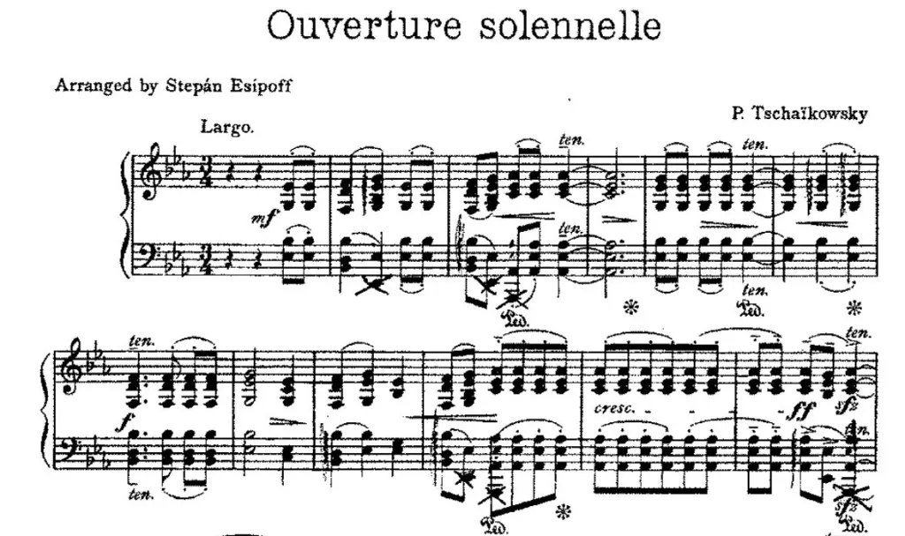

<p align="center">
  
</p>

<h1 align="center">SightRead</h1>

<p align="center">
  A code-reading enhancer for the vibe-coding era, focused on the micro-scale reading of code.<br>
  Highlighting, marking, one-key fold/unfold, visual reinforcement of code segments — so you can understand code <b>in place</b>.
</p>

<p align="center">
  <a href="https://marketplace.visualstudio.com/items?itemName=WaylongLeon.sightread"></a>
  <a href="https://marketplace.visualstudio.com/items?itemName=WaylongLeon.sightread"></a>
  <a href="https://marketplace.visualstudio.com/items?itemName=WaylongLeon.sightread&amp;ssr=false#review-details"></a>
  <a href="https://open-vsx.org/extension/WaylongLeon/sightread"></a>
  <a href="LICENSE"></a>
</p>

<p align="center"><b>English</b> | <a href="README-CN.md">简体中文</a></p>

## 💭 Why

<p align="center">
  
</p>

> Those who don't read the code cannot steer the product, cannot control the quality of the project, and cannot learn anything.

You let an agent write the code — but if you never read that code, whatever it writes has nothing to do with you.
Idea is cheap, code is even cheaper these days. AI is your tool, not your master. And what still matters these days is your experience of your own adventure.

To be fair, reading or not reading the code is often not really a question — merely a choice of values.
This extension offers some visual assistance to those who still want to read code, hoping it helps you read faster and smoother.

Humans are no longer the main producers of code — machines are. Reading code, understanding it and making decisions is today's bottleneck. Facing a wall of code, an LLM can lay out the big structure and framework for you, but it cannot do the close reading for you (reading the detailed code costs the same as reading the LLM's summary of it).
SightRead goes the opposite way: no LLM required, it strengthens the *human* ability to read itself, draping a layer of visual aids over your code (toggleable at any time) — so that, like a musician sight-reading a score, the logical picture surfaces the moment you see the code.

<p align="center">
  
</p>

## ✨ Features

<p align="center">
  
</p>

Five orthogonal features, each providing a different kind of visual assistance (see design.md §2):

- 🦴 **Skeleton fold** — quickly fold and unfold the existing blocks inside a function. When reading a function, fold everything first to see its large structure, then expand the blocks you're interested in and read them closely.
- 🖍️ **Highlighter (markers)** — for the hard-to-read, tricky blocks: swipe a highlighter mark over them first, optionally with a short note saying what the block does.
- 🎯 **Variable tint** — within the context of the enclosing function, outlines the symbol under the cursor, so you can see at a glance where this variable was created and where it is used.
- 🔦 **Spotlight** — removes the visual noise of other functions and unrelated blocks. Click the 👁 item in the status bar and pick a level.
  1. **Function** — only the current function; other functions are dimmed
  2. **Segment** — only the current block; other blocks are dimmed
  3. **Segment+Var** — the current block plus the related blocks; everything else is dimmed — the mode I use the most.
  4. **Off** — spotlight off, the default mode.
- 🧩 **Auto segmentation** — splits a function into a **recursive structure** by blank lines + keywords, so the Segments panel can show the function's large structure; click a node to jump to that block. Next to each node, a dimmed detail text shows its condensed condition or expression (hover for the full header line). The panel follows your cursor — the segment under it gets selected, and with the spotlight on, unrelated segments dim in the panel just like in the editor.
- 🚪 **Entry points** — a sidebar view listing where a file's control flow can be entered from the outside, so you can read a file starting from its entries and follow the references down, instead of starting from line one. Each top-level symbol is classified by where its references live: referenced from another file → entry; referenced only within the file → hidden; no references anywhere → a de-emphasized "suspected" entry (framework hooks like `activate`, route handlers — or dead code). Gutter chevrons (») mark the entry lines in the editor.
- 🧭 **Trail** — a sidebar view that turns your navigation into a call map, while it is open: jump to a definition and the callee appears under the function you came from; jump to a reference and the caller becomes the parent. No project scan, no LLM — only the structural jumps you actually make are recorded (each one verified against the definition provider), so the structure emerges as you read. Children are ordered by call site, functions reached from several callers get a `↗ n callers` badge, and nodes whose body carries a highlighter marker are tinted in the marker's color. The trail lives in memory only and is discarded when the window closes.
- 🗂️ **Sidebar** — the SightRead activity-bar container holds four views: **Entry Points** (where to start reading the file), **Segments** (the current function's segment tree), **Markers** (all highlighter marks in the workspace) and **Trail** (the call structure you have walked). All four follow the cursor. Together they naturally cover what Outline does — where Outline lists every symbol unfiltered, SightRead shows you the real structure of the code you are actually reading.

## ⌨️ Commands

All commands live under the `SightRead:` prefix in the Command Palette. The everyday ones are also in the editor right-click menu (**SightRead** submenu) and on the sidebar view title bars.

| Command | What it does |
|---|---|
| `SightRead: Fold Skeleton (Current Function)` | fold every block inside the current function to see its large structure |
| `SightRead: Unfold Skeleton (Current Function)` | unfold them again |
| `SightRead: Mark Selection (Favorite Color)` | one-click marker in your favorite color (`sightread.marker.favoriteColor`) |
| `SightRead: Mark Selection (Pick Color)…` | highlighter-mark the selection, picking a color |
| `SightRead: Mark Selection (Color + Note)…` | pick a color and attach an optional note |
| `SightRead: Add/Edit Marker Note` | attach or edit the short note on the marker under the cursor |
| `SightRead: Remove Markers in Selection` | clear markers touching the selection |
| `SightRead: Remove Markers in Current Function` | clear markers in the enclosing function |
| `SightRead: Remove Markers in File` | clear markers in the current file |
| `SightRead: Remove All Markers (Workspace)` | clear every marker in the workspace |
| `SightRead: Choose Spotlight Level…` | pick the level from a list, same as clicking the 👁 status-bar item |
| `SightRead: Spotlight: Focus Current Function` | jump straight to the Function level |
| `SightRead: Spotlight: Focus Current Segment` | jump straight to the Segment level |
| `SightRead: Spotlight: Focus Segment + Variable Uses` | jump straight to the Segment+Var level |
| `SightRead: Spotlight: Off` | turn the spotlight off |
| `SightRead: Toggle Variable Tint` | turn occurrence outlining on or off |
| `SightRead: Go to Segment…` | QuickPick over the current function's segments |
| `SightRead: Go to Entry Point…` | QuickPick over the file's entry points |
| `SightRead: Refresh Entry Points` | re-scan the current file's entries |
| `SightRead: Pin Current Function to Trail` | seed the trail with the current function as a root |
| `SightRead: Pause Trail Recording` / `Resume Trail Recording` | stop/restart recording while the Trail view stays open |
| `SightRead: Clear Trail` | discard the recorded call map |

## ⚙️ Settings

| Setting | Default | |
|---|---|---|
| `sightread.variableTint.enabled` | `true` | occurrence outlining on cursor move |
| `sightread.spotlight.defaultMode` | `off` | spotlight mode on startup (off / seg+var / seg / fn) |
| `sightread.spotlight.functionDimOpacity` | `0.15` | dim level outside the function |
| `sightread.spotlight.segmentDimOpacity` | `0.4` | dim level for non-related code in the function |
| `sightread.spotlight.siblingDimOpacity` | `0.6` | dim level for siblings of the cursor's segment |
| `sightread.entries.languageHints` | `true` | classify no-reference symbols by language syntax (`export`/`pub`, Go capitalization, `_` prefix) |
| `sightread.entries.showSuspected` | `true` | show "suspected" entries (symbols with no references found) |
| `sightread.entries.gutterIcons` | `true` | mark entry lines with gutter chevrons (») |
| `sightread.entries.iconColor` | `#8C8C8C` | chevron color; suspected entries use it at reduced opacity |
| `sightread.marker.favoriteColor` | `yellow` | color used by `Mark Selection (Favorite Color)` |
| `sightread.marker.notePosition` | `lineEnd` | marker note at line start or line end |

## 🛠️ Development

```bash
npm install
npm run compile     # type-check + lint + bundle
npm run test:unit   # fast pure-logic tests (mocha)
npm test            # full integration tests in a VS Code host
```

Press `F5` in VS Code to launch the Extension Development Host.

- `npm run watch` — incremental build (esbuild + tsc type-checking in parallel)
- `npm run package` — production bundle

Architecture (see design.md §四): `src/core/` is pure logic (segmentation, marker math, focus algebra — unit-tested, zero vscode imports); `src/vs/` is the platform layer, with **all** decoration rendering flowing through a single compositor.
